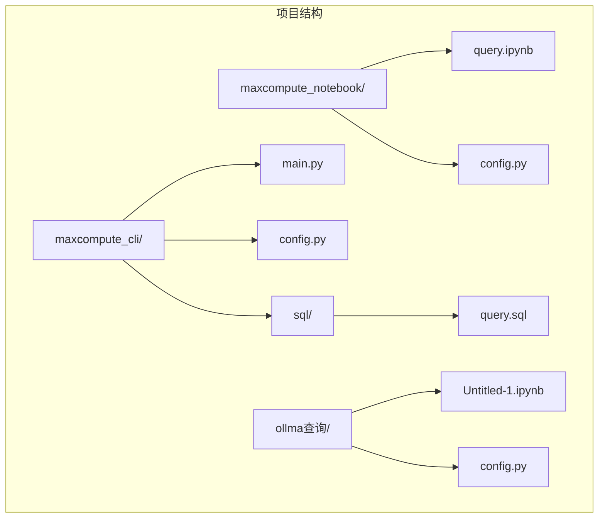
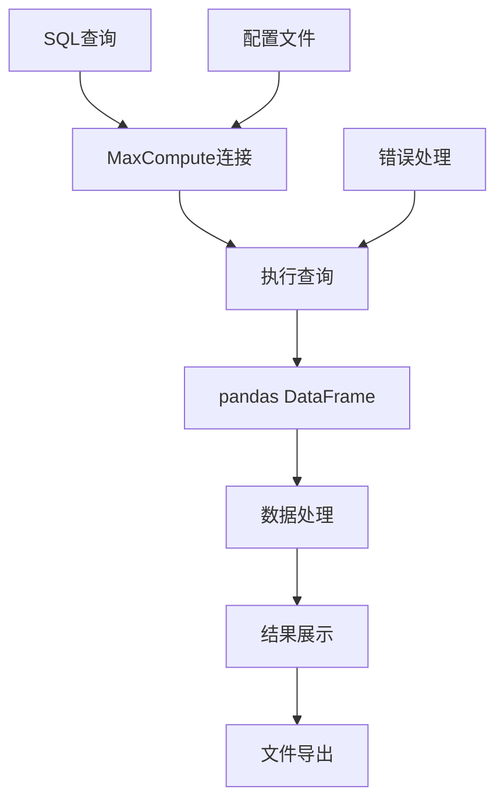
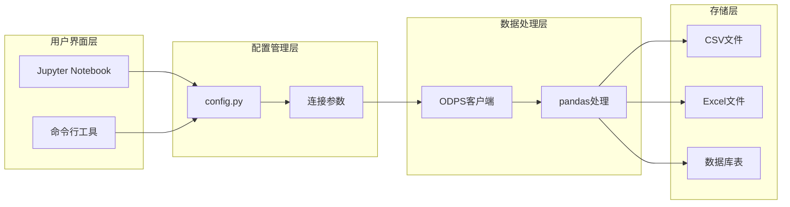
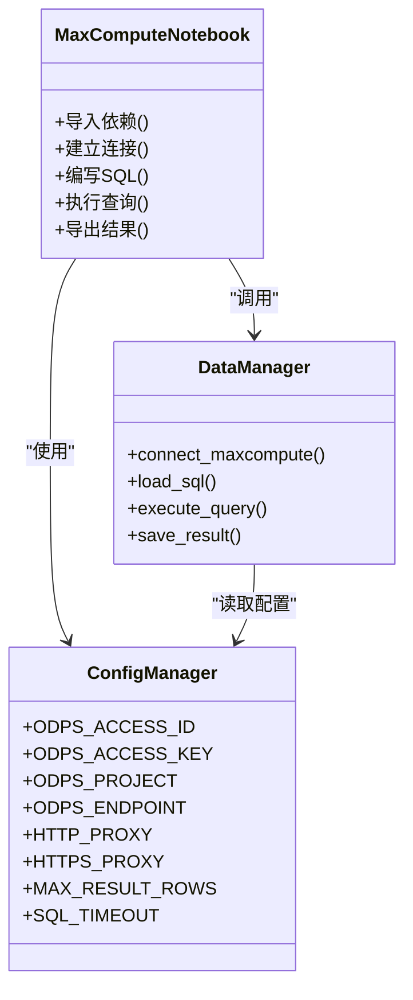
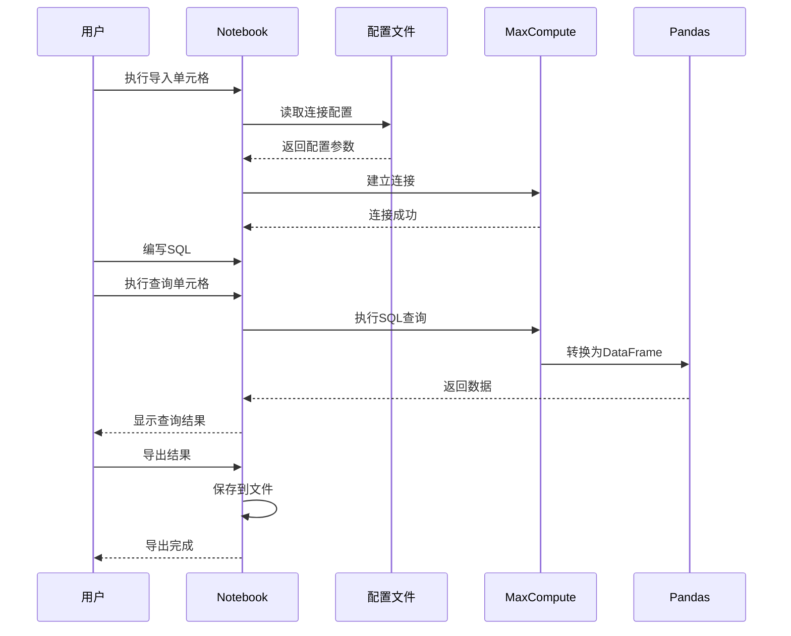
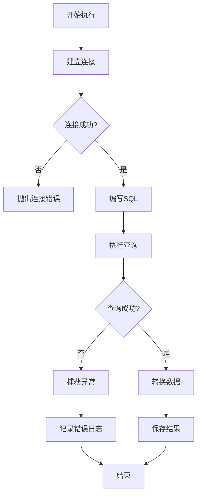
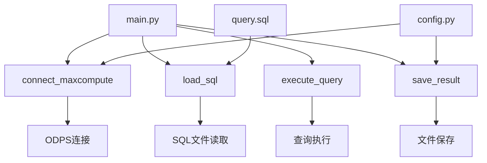
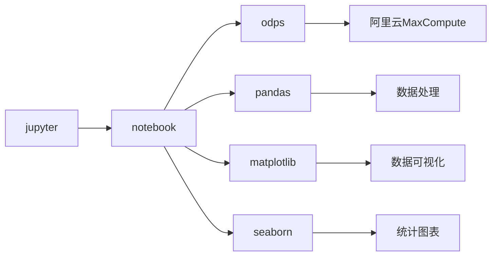
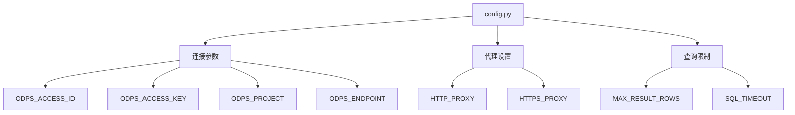
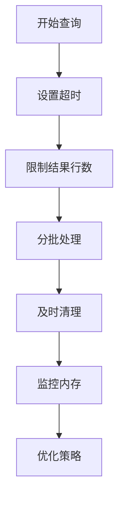

# Notebook使用指南

<cite>
**本文档引用的文件**
- [query.ipynb](file://maxcompute_notebook/query.ipynb)
- [config.py](file://maxcompute_notebook/config.py)
- [main.py](file://maxcompute_cli/main.py)
- [config.py](file://maxcompute_cli/config.py)
- [query.sql](file://maxcompute_cli/sql/query.sql)
- [config.py](file://ollma查询/config.py)
- [Untitled-1.ipynb](file://ollma查询/Untitled-1.ipynb)
</cite>

## 目录
1. [简介](#简介)
2. [项目结构](#项目结构)
3. [核心组件](#核心组件)
4. [架构概览](#架构概览)
5. [详细组件分析](#详细组件分析)
6. [依赖关系分析](#依赖关系分析)
7. [性能考虑](#性能考虑)
8. [故障排除指南](#故障排除指南)
9. [结论](#结论)
10. [附录](#附录)

## 简介

本指南面向希望掌握Jupyter Notebook使用的用户，无论您是初学者还是有经验的开发者。本项目提供了完整的Notebook使用示例，包括：

- **基础操作**：界面组成、单元格类型、执行流程
- **数据分析**：MaxCompute数据查询、数据处理、结果导出
- **可视化展示**：表格渲染、图表生成
- **高级功能**：配置管理、错误处理、性能优化
- **实用技巧**：快捷键、调试方法、最佳实践

## 项目结构

本仓库包含三个主要的Notebook项目，每个都展示了不同的使用场景：

**图表来源**
- [query.ipynb:1-142](file://maxcompute_notebook/query.ipynb#L1-L142)
- [main.py:1-102](file://maxcompute_cli/main.py#L1-L102)

**章节来源**
- [query.ipynb:1-142](file://maxcompute_notebook/query.ipynb#L1-L142)
- [main.py:1-102](file://maxcompute_cli/main.py#L1-L102)

## 核心组件

### Notebook界面组成

Jupyter Notebook界面由多个功能区域组成：

1. **菜单栏**：包含文件、编辑、查看、插入、运行、窗口、帮助等选项
2. **工具栏**：快速执行单元格、切换单元格类型、添加/删除单元格
3. **单元格区域**：包含代码单元格和Markdown单元格
4. **侧边栏**：显示文件树和内核状态

### 单元格类型与功能

**代码单元格**：
- 用于编写和执行Python代码
- 支持语法高亮和智能提示
- 可以显示输出结果

**Markdown单元格**：
- 用于编写文档和说明
- 支持富文本格式化
- 可以包含图片、链接、数学公式

### 数据处理管道

**图表来源**
- [query.ipynb:34-93](file://maxcompute_notebook/query.ipynb#L34-L93)
- [main.py:38-67](file://maxcompute_cli/main.py#L38-L67)

**章节来源**
- [query.ipynb:14-93](file://maxcompute_notebook/query.ipynb#L14-L93)

## 架构概览

整个系统采用模块化设计，通过配置文件管理连接参数，通过Notebook提供交互式开发环境。

**图表来源**
- [config.py:5-17](file://maxcompute_notebook/config.py#L5-L17)
- [main.py:14-17](file://maxcompute_cli/main.py#L14-L17)

## 详细组件分析

### MaxCompute查询Notebook分析

#### 核心功能模块

该Notebook实现了完整的数据查询工作流：

1. **依赖导入模块**：负责导入必要的库和配置
2. **连接建立模块**：建立与MaxCompute服务的连接
3. **SQL编写模块**：提供SQL编写区域
4. **查询执行模块**：执行SQL并处理结果
5. **结果导出模块**：将结果保存到文件

#### 类关系图

**图表来源**
- [query.ipynb:14-132](file://maxcompute_notebook/query.ipynb#L14-L132)
- [config.py:5-17](file://maxcompute_notebook/config.py#L5-L17)

#### 执行序列图

**图表来源**
- [query.ipynb:34-132](file://maxcompute_notebook/query.ipynb#L34-L132)

#### 错误处理流程

**图表来源**
- [query.ipynb:77-93](file://maxcompute_notebook/query.ipynb#L77-L93)

**章节来源**
- [query.ipynb:14-132](file://maxcompute_notebook/query.ipynb#L14-L132)
- [config.py:5-17](file://maxcompute_notebook/config.py#L5-L17)

### AI查询Notebook分析

#### 错误示例分析

该Notebook展示了常见的语法错误场景：

**图表来源**
- [Untitled-1.ipynb:3-19](file://ollma查询/Untitled-1.ipynb#L3-L19)

**章节来源**
- [Untitled-1.ipynb:1-43](file://ollma查询/Untitled-1.ipynb#L1-L43)

### CLI工具对比分析

#### 命令行工具架构

**图表来源**
- [main.py:20-67](file://maxcompute_cli/main.py#L20-L67)
- [config.py:5-22](file://maxcompute_cli/config.py#L5-L22)

**章节来源**
- [main.py:1-102](file://maxcompute_cli/main.py#L1-L102)
- [config.py:1-22](file://maxcompute_cli/config.py#L1-L22)

## 依赖关系分析

### Python包依赖

**图表来源**
- [query.ipynb:21-22](file://maxcompute_notebook/query.ipynb#L21-L22)

### 配置依赖关系

**图表来源**
- [config.py:5-17](file://maxcompute_notebook/config.py#L5-L17)

**章节来源**
- [config.py:1-18](file://maxcompute_notebook/config.py#L1-L18)
- [config.py:1-22](file://maxcompute_cli/config.py#L1-L22)

## 性能考虑

### 查询性能优化

1. **连接池管理**：复用MaxCompute连接减少建立连接的开销
2. **数据分页**：合理设置MAX_RESULT_ROWS避免大数据量查询
3. **超时控制**：设置SQL_TIMEOUT防止长时间阻塞
4. **内存管理**：及时释放pandas DataFrame占用的内存

### 内存使用优化

**图表来源**
- [config.py:15-17](file://maxcompute_notebook/config.py#L15-L17)

## 故障排除指南

### 常见问题及解决方案

#### 连接问题
- **问题**：无法连接到MaxCompute服务
- **原因**：网络代理配置错误、认证信息不正确
- **解决**：检查config.py中的连接参数，确认网络可达性

#### 查询失败
- **问题**：SQL执行超时或返回错误
- **原因**：SQL语法错误、权限不足、数据量过大
- **解决**：优化SQL查询，增加超时时间，检查权限设置

#### 数据处理错误
- **问题**：pandas转换失败或内存溢出
- **原因**：数据格式不兼容、内存不足
- **解决**：分批处理数据，检查数据类型，增加内存限制

#### 文件导出问题
- **问题**：CSV或Excel文件保存失败
- **原因**：缺少相关依赖包、文件路径权限不足
- **解决**：安装openpyxl，检查输出目录权限

**章节来源**
- [query.ipynb:125-131](file://maxcompute_notebook/query.ipynb#L125-L131)

## 结论

本指南展示了Jupyter Notebook在数据分析领域的强大功能，通过MaxCompute集成实现了云端数据查询和处理的完整工作流。关键要点包括：

1. **界面友好**：直观的交互式开发环境
2. **功能丰富**：支持多种数据源和处理方式
3. **易于扩展**：模块化的架构便于功能扩展
4. **实用性强**：提供完整的数据处理解决方案

建议用户根据具体需求选择合适的工具：对于交互式探索使用Notebook，对于批量处理使用命令行工具。

## 附录

### 快速开始指南

1. **安装依赖**：确保安装了Jupyter、pandas、odps等必要包
2. **配置连接**：修改config.py中的连接参数
3. **编写SQL**：在Notebook中编写查询语句
4. **执行查询**：按顺序执行各个单元格
5. **分析结果**：查看和分析查询结果
6. **导出数据**：将结果保存到文件

### 最佳实践

1. **代码组织**：将相关功能组织在不同单元格中
2. **错误处理**：为关键操作添加适当的错误处理
3. **性能监控**：关注查询时间和内存使用情况
4. **文档编写**：使用Markdown单元格记录说明
5. **版本控制**：对Notebook文件进行版本管理