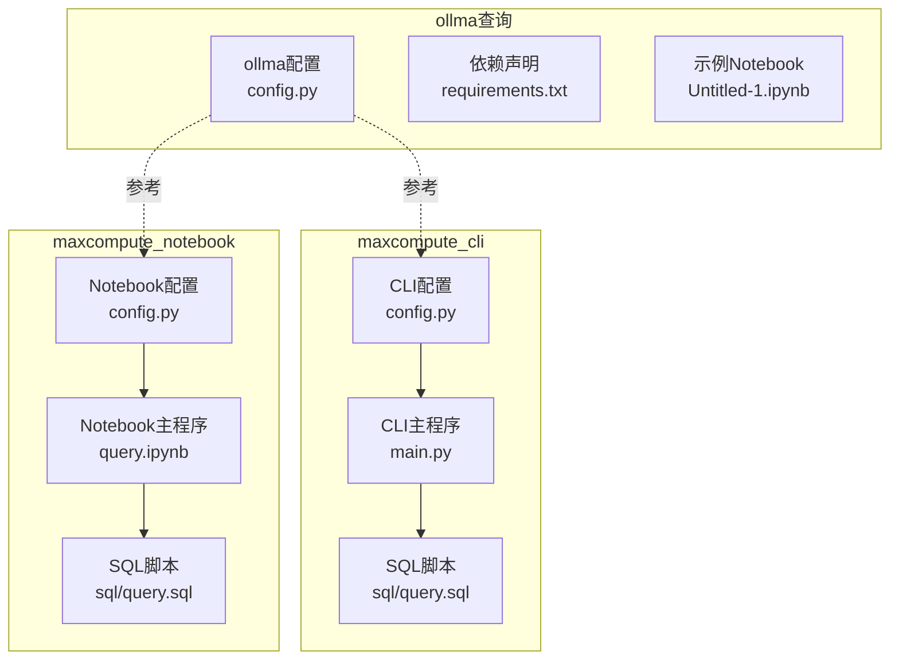
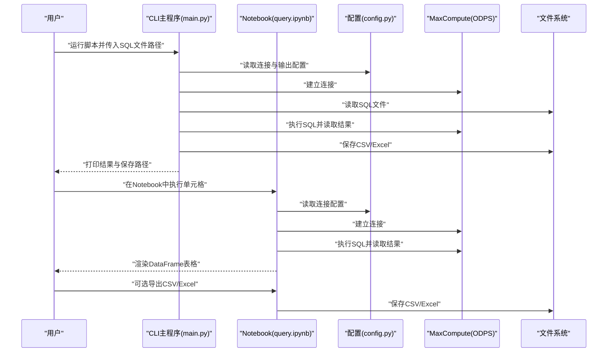
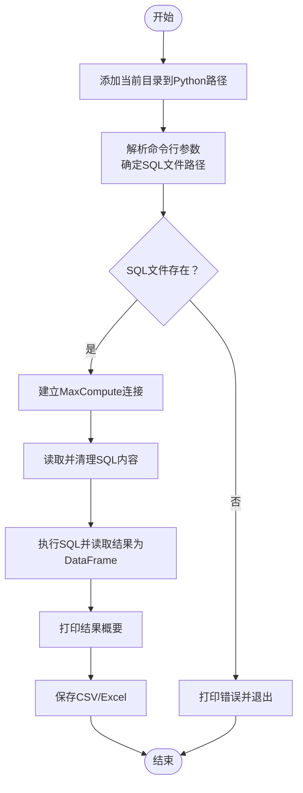
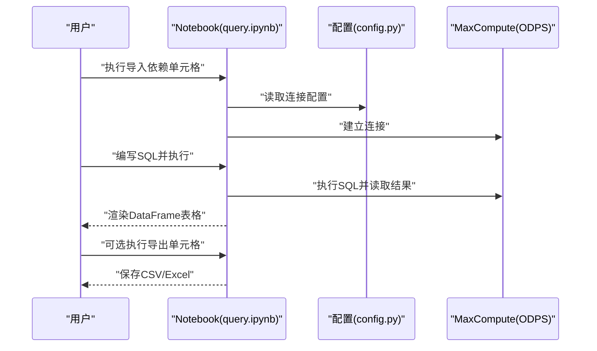
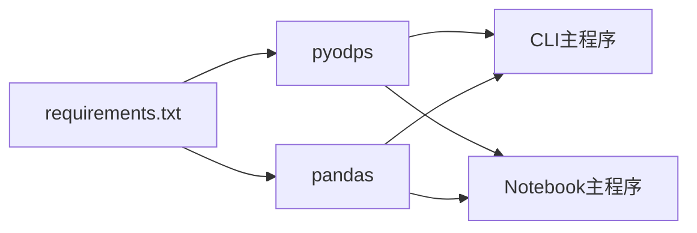

# 业务逻辑模块

<cite>
**本文引用的文件**
- [config.py](file://ollma查询/config.py)
- [requirements.txt](file://ollma查询/requirements.txt)
- [Untitled-1.ipynb](file://ollma查询/Untitled-1.ipynb)
- [main.py](file://maxcompute_cli/main.py)
- [config.py](file://maxcompute_cli/config.py)
- [query.sql](file://maxcompute_cli/sql/query.sql)
- [config.py](file://maxcompute_notebook/config.py)
- [query.ipynb](file://maxcompute_notebook/query.ipynb)
- [query.sql](file://maxcompute_notebook/sql/query.sql)
</cite>

## 目录
1. [简介](#简介)
2. [项目结构](#项目结构)
3. [核心组件](#核心组件)
4. [架构总览](#架构总览)
5. [详细组件分析](#详细组件分析)
6. [依赖分析](#依赖分析)
7. [性能考虑](#性能考虑)
8. [故障排查指南](#故障排查指南)
9. [结论](#结论)
10. [附录](#附录)

## 简介
本项目围绕“业务逻辑模块”展开，提供两类使用场景与对应的模块化实现：
- 终端版（CLI）：通过命令行执行 SQL 查询，连接 MaxCompute 并将结果保存为 CSV 或 Excel 文件。
- Notebook 版：在 Jupyter Notebook 中交互式地连接 MaxCompute、编写并执行 SQL、查看结果，并可导出为 CSV/Excel。

两个版本共享统一的配置管理与数据处理流程，分别面向自动化批处理（CLI）与交互式探索（Notebook），体现模块化的设计理念：将“连接配置”“SQL 加载/执行”“结果保存/导出”等职责拆分为独立模块，便于复用、扩展与维护。

## 项目结构
项目由多个子模块组成，按功能域划分：
- 配置模块：集中管理 MaxCompute 连接参数、代理设置、查询限制与输出格式等。
- CLI 主程序：封装连接、SQL 加载、执行、结果保存的完整流程。
- Notebook 主程序：在 Jupyter 环境中提供连接、执行、渲染与导出能力。
- SQL 脚本：存放可编辑的查询语句模板。
- 依赖声明：定义运行所需的第三方库。

图表来源
- [config.py](file://ollma查询/config.py)
- [requirements.txt](file://ollma查询/requirements.txt)
- [main.py](file://maxcompute_cli/main.py)
- [config.py](file://maxcompute_cli/config.py)
- [query.sql](file://maxcompute_cli/sql/query.sql)
- [config.py](file://maxcompute_notebook/config.py)
- [query.ipynb](file://maxcompute_notebook/query.ipynb)
- [query.sql](file://maxcompute_notebook/sql/query.sql)

章节来源
- [config.py](file://ollma查询/config.py)
- [requirements.txt](file://ollma查询/requirements.txt)
- [main.py](file://maxcompute_cli/main.py)
- [config.py](file://maxcompute_cli/config.py)
- [query.sql](file://maxcompute_cli/sql/query.sql)
- [config.py](file://maxcompute_notebook/config.py)
- [query.ipynb](file://maxcompute_notebook/query.ipynb)
- [query.sql](file://maxcompute_notebook/sql/query.sql)

## 核心组件
- 配置模块（config.py）
  - 提供 MaxCompute 连接参数（AccessId、AccessKey、Project、Endpoint）、代理设置、查询限制（最大行数、超时）、输出目录与格式等。
  - CLI 与 Notebook 版本各自维护一份配置，便于独立部署与定制。
- CLI 主程序（main.py）
  - 职责：连接 MaxCompute → 读取 SQL 文件 → 执行查询 → 打印结果 → 保存为 CSV/Excel。
  - 关键函数：连接、SQL 加载、执行、保存。
- Notebook 主程序（query.ipynb）
  - 职责：在 Jupyter 环境中建立连接、编写 SQL、执行并渲染结果、可选导出 CSV/Excel。
  - 关键步骤：导入依赖 → 建立连接 → 编写 SQL → 执行查询 → 渲染结果 → 导出。
- SQL 脚本（sql/query.sql）
  - 提供可编辑的 SQL 模板，支持单条或多条语句（Notebook 版本支持多行拼接）。

章节来源
- [config.py](file://maxcompute_cli/config.py)
- [main.py](file://maxcompute_cli/main.py)
- [config.py](file://maxcompute_notebook/config.py)
- [query.ipynb](file://maxcompute_notebook/query.ipynb)
- [query.sql](file://maxcompute_cli/sql/query.sql)
- [query.sql](file://maxcompute_notebook/sql/query.sql)

## 架构总览
两种使用模式采用相同的底层数据流：配置驱动 → 连接建立 → SQL 解析/执行 → 结果转换为 DataFrame → 渲染/导出。差异在于入口与交互方式：
- CLI：命令行入口，适合批处理与自动化。
- Notebook：交互式入口，适合探索性分析与可视化。

图表来源
- [main.py](file://maxcompute_cli/main.py)
- [config.py](file://maxcompute_cli/config.py)
- [query.ipynb](file://maxcompute_notebook/query.ipynb)
- [config.py](file://maxcompute_notebook/config.py)

## 详细组件分析

### CLI 主程序（main.py）
- 设计要点
  - 将当前目录加入 Python 路径，确保能正确导入同级 config。
  - 通过命令行参数支持自定义 SQL 文件路径，默认从 sql/query.sql 读取。
  - 对 SQL 文件进行注释与空行清理，提升健壮性。
  - 使用 pandas 将查询结果转为 DataFrame，再保存为 CSV 或 Excel。
- 内部结构与流程
  - 连接函数：建立 ODPS 实例并打印连接信息。
  - SQL 加载函数：读取文件内容并过滤注释与空行。
  - 执行函数：打开 SQL 读取器，转为 pandas DataFrame。
  - 保存函数：按配置选择输出目录与格式，生成带时间戳的文件名。
  - 主流程：依次执行连接、加载、执行、打印、保存。
- 错误处理
  - SQL 文件不存在时提示错误并退出。
  - 执行阶段异常需结合日志定位（建议在生产环境增加 try-except）。

图表来源
- [main.py](file://maxcompute_cli/main.py)

章节来源
- [main.py](file://maxcompute_cli/main.py)
- [config.py](file://maxcompute_cli/config.py)
- [query.sql](file://maxcompute_cli/sql/query.sql)

### Notebook 主程序（query.ipynb）
- 设计要点
  - 在 Notebook 中动态导入依赖与配置，建立连接后允许用户在单元格中编写 SQL。
  - 执行后直接返回 DataFrame，由 Jupyter 自动渲染为表格。
  - 提供可选导出 CSV/Excel 的单元格，便于离线保存。
- 内部结构与流程
  - 导入依赖与配置 → 建立连接 → 编写 SQL（字符串）→ 执行查询 → 渲染结果 → 可选导出。
- 交互优势
  - 适合探索性分析与快速验证 SQL 正确性；可与其他 Notebook 功能（如可视化）无缝集成。

图表来源
- [query.ipynb](file://maxcompute_notebook/query.ipynb)
- [config.py](file://maxcompute_notebook/config.py)

章节来源
- [query.ipynb](file://maxcompute_notebook/query.ipynb)
- [config.py](file://maxcompute_notebook/config.py)
- [query.sql](file://maxcompute_notebook/sql/query.sql)

### 配置模块（config.py）
- CLI 配置（maxcompute_cli/config.py）
  - 连接参数：AccessId、AccessKey、Project、Endpoint。
  - 代理设置：HTTP_PROXY、HTTPS_PROXY。
  - 查询限制：MAX_RESULT_ROWS、SQL_TIMEOUT。
  - 输出配置：OUTPUT_DIR、OUTPUT_FORMAT。
- Notebook 配置（maxcompute_notebook/config.py）
  - 同样包含连接参数与查询限制，便于在 Notebook 环境中直接使用。
- Ollama 查询配置（ollma查询/config.py）
  - 包含 MaxCompute 参数与本地大模型服务参数（如 OLLAMA_BASE_URL、OLLAMA_MODEL）。
  - 该配置与 CLI/Notebook 的 MaxCompute 配置相互独立，但可作为参考或迁移依据。

章节来源
- [config.py](file://maxcompute_cli/config.py)
- [config.py](file://maxcompute_notebook/config.py)
- [config.py](file://ollma查询/config.py)

### SQL 脚本（sql/query.sql）
- CLI 版本：提供基础查询模板，支持注释与空行清理。
- Notebook 版本：支持多行 SQL，便于复杂查询的逐步构建与测试。

章节来源
- [query.sql](file://maxcompute_cli/sql/query.sql)
- [query.sql](file://maxcompute_notebook/sql/query.sql)

## 依赖分析
- 第三方依赖
  - pyodps：MaxCompute 官方 Python SDK，负责连接与执行 SQL。
  - pandas：数据处理与 DataFrame 转换。
  - streamlit/openai（Notebook 版本可选）：用于界面或 LLM 集成（视具体需求而定）。
- 依赖声明
  - requirements.txt 明确列出所需库版本范围，便于环境一致性管理。
- 模块间耦合
  - CLI/Notebook 分别依赖各自的 config，降低耦合度，便于独立演进。
  - 两者均依赖 ODPS 与 pandas，形成稳定的外部接口契约。

图表来源
- [requirements.txt](file://ollma查询/requirements.txt)
- [main.py](file://maxcompute_cli/main.py)
- [query.ipynb](file://maxcompute_notebook/query.ipynb)

章节来源
- [requirements.txt](file://ollma查询/requirements.txt)
- [main.py](file://maxcompute_cli/main.py)
- [query.ipynb](file://maxcompute_notebook/query.ipynb)

## 性能考虑
- 查询限制
  - 合理设置 MAX_RESULT_ROWS 与 SQL_TIMEOUT，避免长时间阻塞与内存溢出。
- 结果导出
  - 大规模结果优先导出为 CSV，必要时再转 Excel；注意编码与列数限制。
- 网络与代理
  - 如需内网访问，配置 HTTP_PROXY/HTTPS_PROXY，减少连接失败与重试开销。
- 批处理优化
  - CLI 适合批量任务，建议将 SQL 拆分为小步执行，配合日志与断点续跑。
- 探索性分析
  - Notebook 适合小规模数据探索，避免一次性加载过多数据导致渲染缓慢。

## 故障排查指南
- Notebook 文件损坏
  - 当前仓库中的 Notebook 文件存在语法错误，无法正常执行。建议：
    - 重新创建 Notebook，复制 query.ipynb 的结构与逻辑。
    - 确保在每个单元格中正确导入依赖与配置。
- SQL 文件缺失
  - CLI 报告 SQL 文件不存在时，请确认路径是否正确，或通过命令行参数传入目标文件。
- 导出失败
  - 若缺少 openpyxl，Notebook 导出 Excel 会报错；安装依赖后重试。
- 连接失败
  - 检查 AccessId、AccessKey、Project、Endpoint 是否正确，网络是否可达，代理设置是否合理。

章节来源
- [Untitled-1.ipynb](file://ollma查询/Untitled-1.ipynb)
- [main.py](file://maxcompute_cli/main.py)
- [query.ipynb](file://maxcompute_notebook/query.ipynb)

## 结论
本项目通过 CLI 与 Notebook 两种入口，实现了 MaxCompute 查询的模块化与可扩展架构。配置模块统一管理连接参数与行为约束，主程序聚焦于连接、执行与导出的核心流程。该设计既满足批处理自动化的需求，也兼顾了交互式探索的灵活性。后续可在不破坏现有模块边界的前提下，按需扩展新功能（如多语句执行、结果缓存、并发控制等）。

## 附录

### 模块导入与使用示例（基于源码路径）
- CLI 方式
  - 在终端执行脚本并传入 SQL 文件路径（默认从 sql/query.sql 读取）。
  - 示例路径：[main.py](file://maxcompute_cli/main.py)
- Notebook 方式
  - 在 Notebook 中执行“导入依赖与配置”“建立连接”“编写 SQL”“执行查询”“导出结果”等单元格。
  - 示例路径：[query.ipynb](file://maxcompute_notebook/query.ipynb)
- 配置参考
  - CLI 配置：[config.py](file://maxcompute_cli/config.py)
  - Notebook 配置：[config.py](file://maxcompute_notebook/config.py)
  - Ollama 查询配置（参考）：[config.py](file://ollma查询/config.py)

### 自定义扩展指南
- 新增 SQL 脚本
  - 在对应模块的 sql 目录下新增 .sql 文件，或在 Notebook 中直接编辑 SQL 字符串。
- 扩展输出格式
  - 在 CLI/Notebook 的保存/导出逻辑中增加新的格式分支（如 Parquet、JSON）。
- 增强错误处理
  - 在连接、执行、导出各阶段增加 try-except 与日志记录，提升可观测性。
- 并发与批处理
  - CLI 可引入队列与并发执行，Notebook 可封装为可复用的工具函数。

### 版本管理与更新策略
- 配置版本化
  - 将 config.py 与 requirements.txt 一并纳入版本控制，确保环境一致性。
- 依赖锁定
  - 使用 requirements.txt 固定版本范围，避免第三方库升级带来的破坏性变更。
- 模块演进
  - 保持 CLI/Notebook 的配置与接口稳定，新增功能通过插件化或可选模块实现，降低破坏性更新风险。