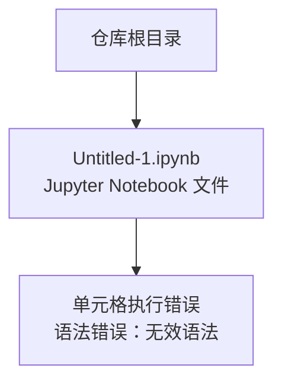
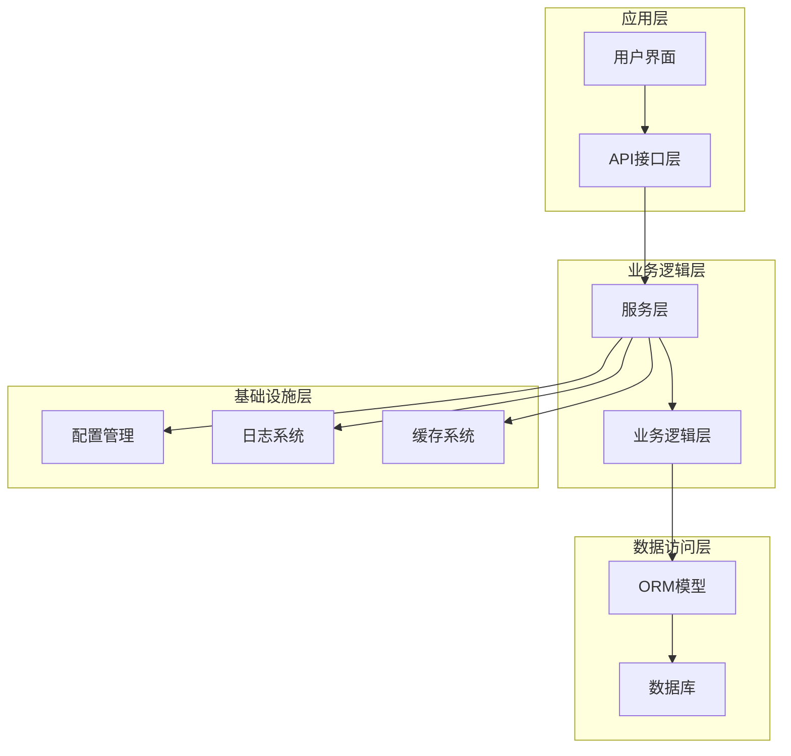
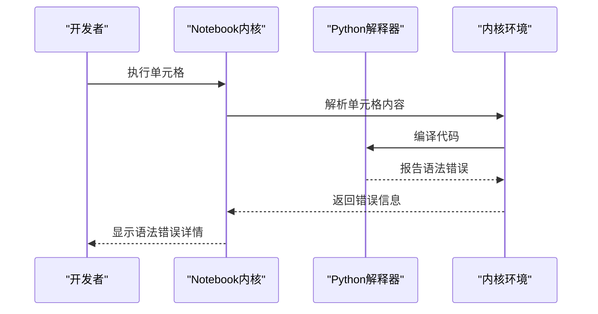
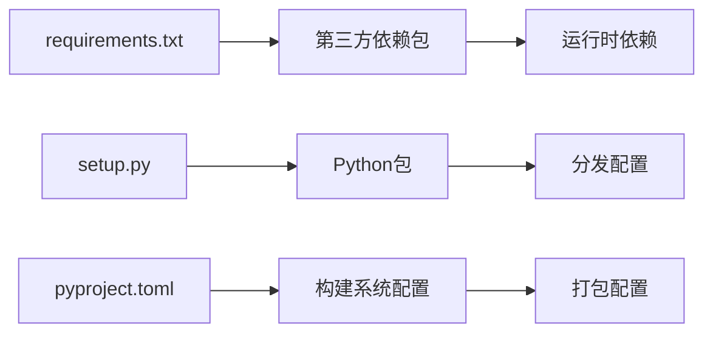
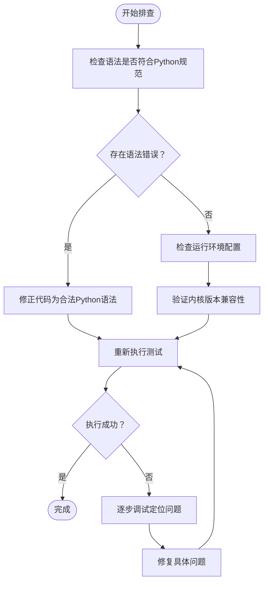

# 开发指南

<cite>
**本文档引用的文件**
- [Untitled-1.ipynb](file://Untitled-1.ipynb)
</cite>

## 目录
1. [简介](#简介)
2. [项目结构](#项目结构)
3. [核心组件](#核心组件)
4. [架构概览](#架构概览)
5. [详细组件分析](#详细组件分析)
6. [依赖关系分析](#依赖关系分析)
7. [性能考虑](#性能考虑)
8. [故障排除指南](#故障排除指南)
9. [结论](#结论)
10. [附录](#附录)

## 简介
本开发指南旨在为Python项目的全生命周期开发提供系统性指导，覆盖从代码编写、测试验证、调试排查到部署运维的完整流程。针对不同经验水平的开发者，文档提供了循序渐进的学习路径与实用建议，帮助团队建立一致的开发标准、提升代码质量与交付效率。

## 项目结构
当前仓库仅包含一个Jupyter Notebook文件，该文件在执行时会报语法错误（将Git命令误当作Python语法）。这表明项目尚未完成初始化或存在脚本混用的问题。

**图表来源**
- [Untitled-1.ipynb:18-21](file://Untitled-1.ipynb#L18-L21)

**章节来源**
- [Untitled-1.ipynb:1-45](file://Untitled-1.ipynb#L1-L45)

## 核心组件
基于现有文件，核心组件为Jupyter Notebook环境及其执行单元格。需要注意的是，当前Notebook中的单元格包含非Python语法（如Git命令），直接运行会导致语法错误。

- **Notebook执行单元格**：包含错误的语法片段，导致执行失败
- **内核信息**：使用Python 3内核，但单元格内容不符合Python语法规范

**章节来源**
- [Untitled-1.ipynb:18-21](file://Untitled-1.ipynb#L18-L21)
- [Untitled-1.ipynb:23-40](file://Untitled-1.ipynb#L23-L40)

## 架构概览
由于当前仓库缺少实际的Python源码文件，无法展示完整的代码架构图。建议在后续开发中采用以下典型架构模式：

## 详细组件分析

### Jupyter Notebook执行流程分析
当前Notebook的执行流程存在语法错误，需要修正为正确的Python语法或使用合适的工具链。

**图表来源**
- [Untitled-1.ipynb:8-16](file://Untitled-1.ipynb#L8-L16)

**章节来源**
- [Untitled-1.ipynb:18-21](file://Untitled-1.ipynb#L18-L21)

### 代码规范与最佳实践
针对Python开发，建议遵循以下规范：

- **命名规范**
  - 模块名：使用小写字母和下划线
  - 类名：使用驼峰命名法
  - 函数名：使用小写字母和下划线
  - 常量：使用大写字母和下划线

- **代码格式**
  - 使用4空格缩进
  - 行长度不超过79字符
  - 在导入语句之间留空行
  - 在函数定义之间留空行

- **注释规范**
  - 模块顶部包含许可证和作者信息
  - 复杂逻辑添加行内注释
  - 公共接口添加docstring

- **类型提示**
  - 为所有公共函数添加类型注解
  - 使用Union、Optional等类型构造器
  - 为变量和参数提供明确类型

**章节来源**
- [Untitled-1.ipynb:29-39](file://Untitled-1.ipynb#L29-L39)

## 依赖关系分析
当前仓库缺少依赖文件，无法进行准确的依赖关系分析。建议在项目中添加以下文件来管理依赖：

## 性能考虑
针对Python应用的性能优化建议：

- **内存管理**
  - 避免创建大型临时对象
  - 及时释放不再使用的资源
  - 使用生成器处理大数据集
  - 监控内存使用情况

- **算法优化**
  - 选择合适的数据结构
  - 避免重复计算
  - 使用内置函数和库
  - 实现缓存机制

- **I/O优化**
  - 批量处理文件操作
  - 使用异步I/O
  - 合理设置缓冲区大小
  - 关闭不必要的连接

- **并发编程**
  - 使用多进程处理CPU密集型任务
  - 使用多线程处理I/O密集型任务
  - 实现线程安全的数据结构
  - 避免死锁和竞态条件

## 故障排除指南

### 常见语法错误
根据当前Notebook显示的错误信息，主要问题在于将Git命令误用为Python语法。解决步骤如下：

**图表来源**
- [Untitled-1.ipynb:8-16](file://Untitled-1.ipynb#L8-L16)

### 调试技巧
- **单元测试**：为每个模块编写独立的测试用例
- **集成测试**：测试模块间的交互和数据流
- **性能测试**：监控内存使用和执行时间
- **日志记录**：添加详细的日志输出便于追踪

**章节来源**
- [Untitled-1.ipynb:8-16](file://Untitled-1.ipynb#L8-L16)

## 结论
当前仓库处于初始阶段，需要完善项目结构、添加Python源码文件和配置文件。建议按照以下步骤推进：
1. 初始化Git仓库并正确配置版本控制
2. 添加Python源码文件和必要的配置文件
3. 建立测试框架和CI/CD流水线
4. 完善文档和开发规范
5. 进行性能优化和部署准备

## 附录

### 开发环境搭建
- Python版本：3.8+
- 包管理：pipenv或poetry
- 代码格式化：black + isort
- 类型检查：mypy
- 测试框架：pytest + coverage

### 版本控制最佳实践
- 分支策略：Git Flow或GitHub Flow
- 提交规范：约定式提交
- 标签管理：语义化版本
- 合并与审查：Pull Request流程

### 部署与运维
- 容器化：Docker镜像构建
- 配置管理：环境变量和配置文件分离
- 监控告警：日志聚合和指标收集
- 回滚策略：蓝绿部署或滚动更新