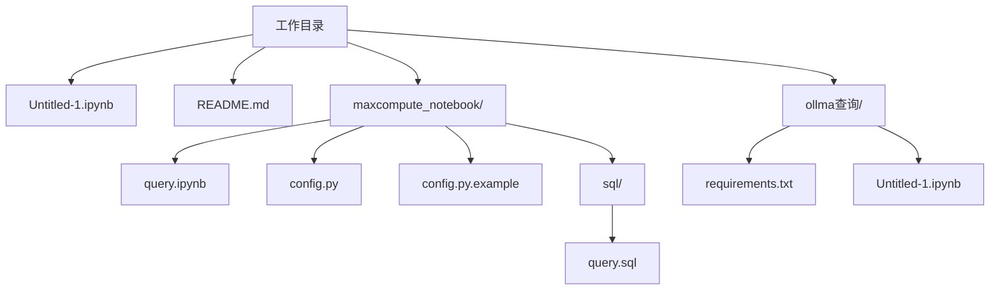
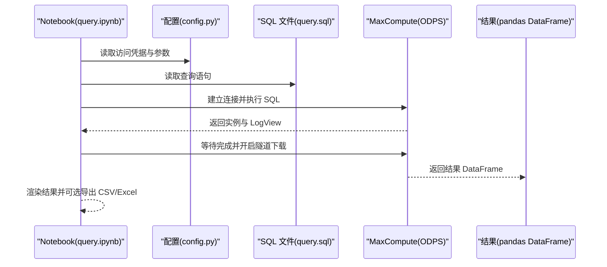
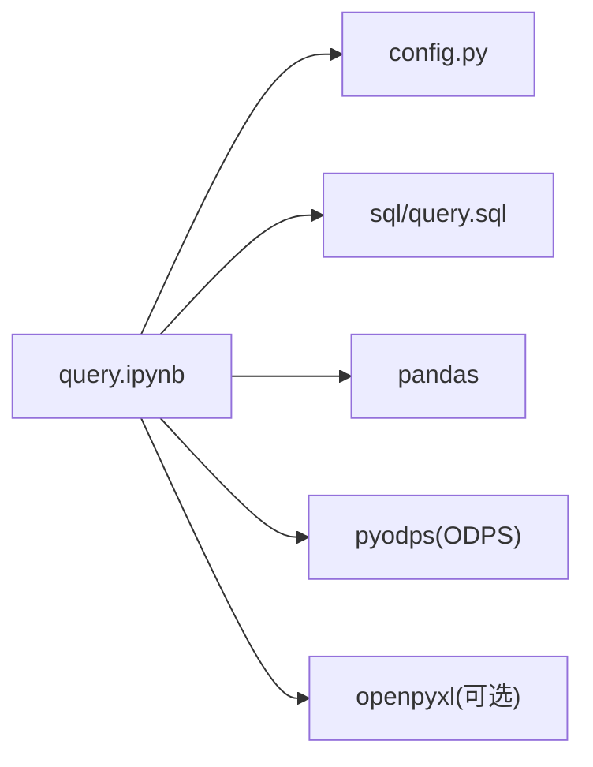

# 快速开始

<cite>
**本文引用的文件**
- [README.md](file://README.md)
- [Untitled-1.ipynb](file://Untitled-1.ipynb)
- [maxcompute_notebook/query.ipynb](file://maxcompute_notebook/query.ipynb)
- [maxcompute_notebook/config.py](file://maxcompute_notebook/config.py)
- [maxcompute_notebook/config.py.example](file://maxcompute_notebook/config.py.example)
- [maxcompute_notebook/sql/query.sql](file://maxcompute_notebook/sql/query.sql)
- [ollma查询/requirements.txt](file://ollma查询/requirements.txt)
- [ollma查询/Untitled-1.ipynb](file://ollma查询/Untitled-1.ipynb)
</cite>

## 目录
1. [简介](#简介)
2. [项目结构](#项目结构)
3. [核心组件](#核心组件)
4. [架构总览](#架构总览)
5. [详细组件分析](#详细组件分析)
6. [依赖关系分析](#依赖关系分析)
7. [性能注意事项](#性能注意事项)
8. [故障排查指南](#故障排查指南)
9. [结论](#结论)
10. [附录](#附录)

## 简介
本指南面向初学者，帮助你在本地快速搭建并运行基于 Jupyter Notebook 的 MaxCompute 查询工具。你将学会：
- 设置 Python 3.13.2 环境
- 安装并启动 Jupyter Notebook
- 配置 MaxCompute 访问凭据
- 运行第一个 Notebook 实例
- 导入并使用业务逻辑（SQL）
- 处理常见初始化问题
- 查看简单数据处理示例

## 项目结构
当前工作目录包含一个基础 Notebook 文件与一个完整的 MaxCompute Notebook 工程，以及一个 AI 辅助查询的示例目录。

图表来源
- [README.md](file://README.md)
- [maxcompute_notebook/query.ipynb](file://maxcompute_notebook/query.ipynb)
- [maxcompute_notebook/config.py](file://maxcompute_notebook/config.py)
- [maxcompute_notebook/config.py.example](file://maxcompute_notebook/config.py.example)
- [maxcompute_notebook/sql/query.sql](file://maxcompute_notebook/sql/query.sql)
- [ollma查询/requirements.txt](file://ollma查询/requirements.txt)
- [ollma查询/Untitled-1.ipynb](file://ollma查询/Untitled-1.ipynb)

章节来源
- [README.md](file://README.md)

## 核心组件
- Jupyter Notebook 环境：用于交互式查询与数据展示
- MaxCompute Notebook（query.ipynb）：封装连接、执行、耗时统计与结果导出
- 配置文件（config.py 与 config.py.example）：存放访问凭据与参数
- SQL 文件（sql/query.sql）：存放查询语句
- 依赖清单（ollma查询/requirements.txt）：AI 辅助查询示例所需的第三方库

章节来源
- [maxcompute_notebook/query.ipynb](file://maxcompute_notebook/query.ipynb)
- [maxcompute_notebook/config.py](file://maxcompute_notebook/config.py)
- [maxcompute_notebook/config.py.example](file://maxcompute_notebook/config.py.example)
- [maxcompute_notebook/sql/query.sql](file://maxcompute_notebook/sql/query.sql)
- [ollma查询/requirements.txt](file://ollma查询/requirements.txt)

## 架构总览
下图展示了 Notebook 执行一次查询的端到端流程：Notebook 读取配置与 SQL，连接 MaxCompute，执行 SQL 并通过隧道加速下载结果，最后渲染与导出结果。

图表来源
- [maxcompute_notebook/query.ipynb](file://maxcompute_notebook/query.ipynb)
- [maxcompute_notebook/config.py](file://maxcompute_notebook/config.py)
- [maxcompute_notebook/sql/query.sql](file://maxcompute_notebook/sql/query.sql)

## 详细组件分析

### 组件一：环境准备与 Python 3.13.2
- 使用 Python 3.13.2 作为内核，确保 Notebook 的语言信息与内核名称匹配
- 若尚未安装 Python 3.13.2，请前往官方渠道下载并配置 PATH
- 验证安装：在终端输入 Python 版本命令，确认显示 3.13.2

章节来源
- [Untitled-1.ipynb](file://Untitled-1.ipynb)

### 组件二：Jupyter Notebook 安装与启动
- 安装 Jupyter Notebook（可使用 pip 或 conda）
- 启动方式：在工程根目录执行 Notebook 启动命令
- 验证：浏览器打开后能看到 Notebook 列表，选择目标 Notebook 打开

章节来源
- [README.md](file://README.md)

### 组件三：配置 MaxCompute 凭据
- 复制示例配置文件为真实配置文件
- 编辑真实配置文件，填入你的 AccessKey ID、AccessKey Secret、项目名与 Endpoint
- 注意：真实配置文件不应提交到版本库，项目中已有忽略规则

章节来源
- [README.md](file://README.md)
- [maxcompute_notebook/config.py.example](file://maxcompute_notebook/config.py.example)
- [maxcompute_notebook/config.py](file://maxcompute_notebook/config.py)

### 组件四：运行第一个 Notebook 实例
- 打开目标 Notebook 文件（例如 query.ipynb）
- 在“设置”单元格中导入依赖并加载配置
- 在“连接”单元格中建立 MaxCompute 连接
- 在“执行查询”单元格中运行查询，观察耗时与 LogView 链接
- 在“导出结果”单元格中将结果保存为 CSV/Excel

章节来源
- [README.md](file://README.md)
- [maxcompute_notebook/query.ipynb](file://maxcompute_notebook/query.ipynb)

### 组件五：导入与使用业务逻辑（SQL）
- Notebook 会从外部 SQL 文件加载查询语句
- 修改 SQL 文件即可切换不同的查询逻辑
- 结果将以 DataFrame 形式展示，并支持导出

章节来源
- [maxcompute_notebook/query.ipynb](file://maxcompute_notebook/query.ipynb)
- [maxcompute_notebook/sql/query.sql](file://maxcompute_notebook/sql/query.sql)

### 组件六：AI 辅助查询示例（可选）
- 该目录提供基于 Streamlit/OpenAI/pyodps/pandas 的示例
- 安装依赖后可运行示例 Notebook
- 适合探索如何结合 AI 与 MaxCompute 进行辅助查询

章节来源
- [ollma查询/requirements.txt](file://ollma查询/requirements.txt)
- [ollma查询/Untitled-1.ipynb](file://ollma查询/Untitled-1.ipynb)

## 依赖关系分析
- Notebook 依赖于配置模块与 SQL 文件
- 配置模块依赖于 MaxCompute SDK（ODPS）
- 结果导出依赖 pandas，可选依赖 openpyxl（用于 Excel）

图表来源
- [maxcompute_notebook/query.ipynb](file://maxcompute_notebook/query.ipynb)
- [maxcompute_notebook/config.py](file://maxcompute_notebook/config.py)
- [maxcompute_notebook/sql/query.sql](file://maxcompute_notebook/sql/query.sql)

章节来源
- [maxcompute_notebook/query.ipynb](file://maxcompute_notebook/query.ipynb)

## 性能注意事项
- 启用 Instance Tunnel 加速数据传输，显著降低下载耗时
- 查询耗时分为 SQL 执行耗时与结果下载耗时，便于定位瓶颈
- 如需进一步优化，可参考 LogView 链接分析执行计划

章节来源
- [README.md](file://README.md)
- [maxcompute_notebook/query.ipynb](file://maxcompute_notebook/query.ipynb)

## 故障排查指南
- 无法启动或内核不可用
  - 确认 Python 3.13.2 已正确安装并加入 PATH
  - 在终端执行 Python 版本命令验证
- 访问凭据错误或连接失败
  - 检查 config.py 中的 AccessKey ID/Secret、项目名与 Endpoint
  - 确认已复制示例配置为真实配置
- 查询超时
  - 检查 SQL 超时时间配置
  - 优化 SQL，减少扫描数据量
- 导出 Excel 失败
  - 安装 openpyxl 后重试
- 笔记本语法错误（示例）
  - 示例 Notebook 中包含无效的命令行代码，属于示例错误，不影响主流程

章节来源
- [README.md](file://README.md)
- [ollma查询/Untitled-1.ipynb](file://ollma查询/Untitled-1.ipynb)

## 结论
通过本指南，你已完成：
- Python 3.13.2 环境与 Jupyter Notebook 的安装与验证
- MaxCompute 凭据配置与连接测试
- 第一个 Notebook 实例的运行与结果导出
- 业务逻辑（SQL）的导入与使用
- 常见问题的识别与解决

现在你可以基于此快速开展数据分析与查询任务。

## 附录
- 快速操作清单
  - 安装 Python 3.13.2
  - 安装 Jupyter Notebook
  - 复制 config.py.example 为 config.py 并填写凭据
  - 在工程根目录启动 Notebook
  - 打开 query.ipynb，依次运行各单元格
  - 查看结果并导出 CSV/Excel
- 参考文件
  - [README.md](file://README.md)
  - [maxcompute_notebook/query.ipynb](file://maxcompute_notebook/query.ipynb)
  - [maxcompute_notebook/config.py](file://maxcompute_notebook/config.py)
  - [maxcompute_notebook/config.py.example](file://maxcompute_notebook/config.py.example)
  - [maxcompute_notebook/sql/query.sql](file://maxcompute_notebook/sql/query.sql)
  - [ollma查询/requirements.txt](file://ollma查询/requirements.txt)
  - [ollma查询/Untitled-1.ipynb](file://ollma查询/Untitled-1.ipynb)