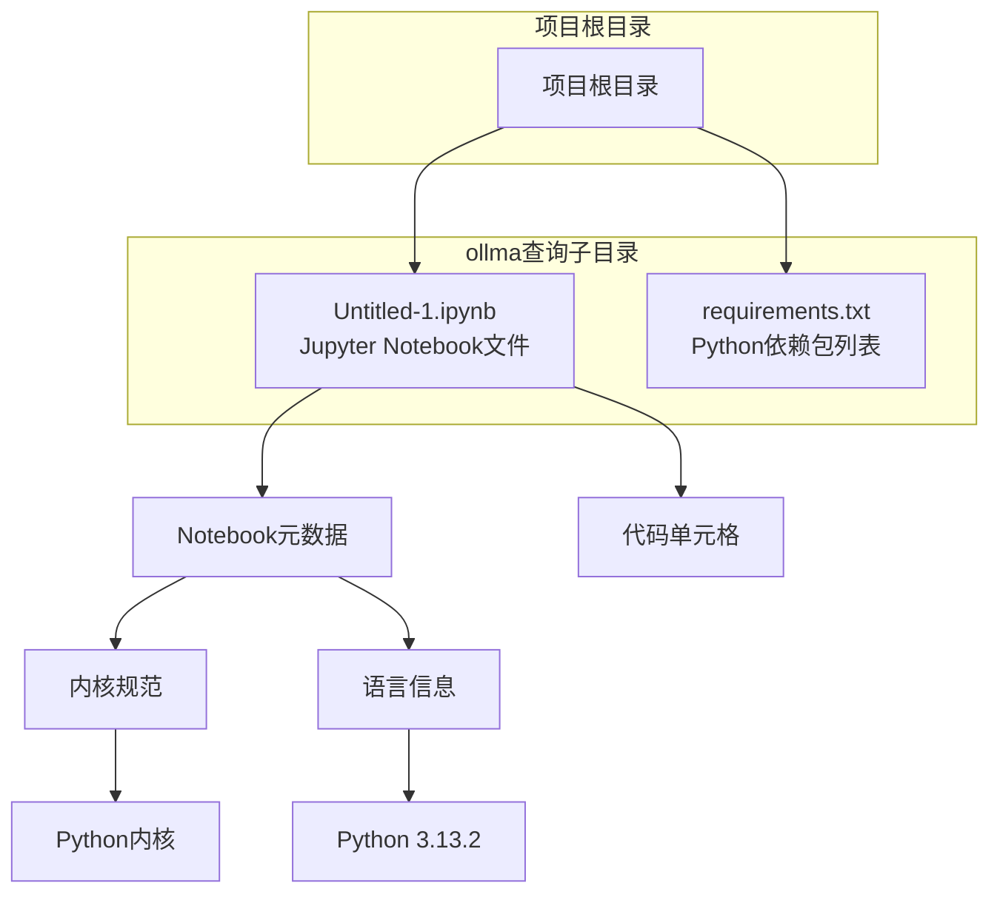
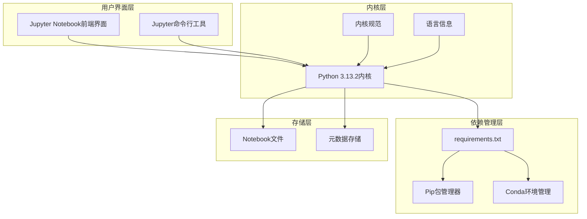
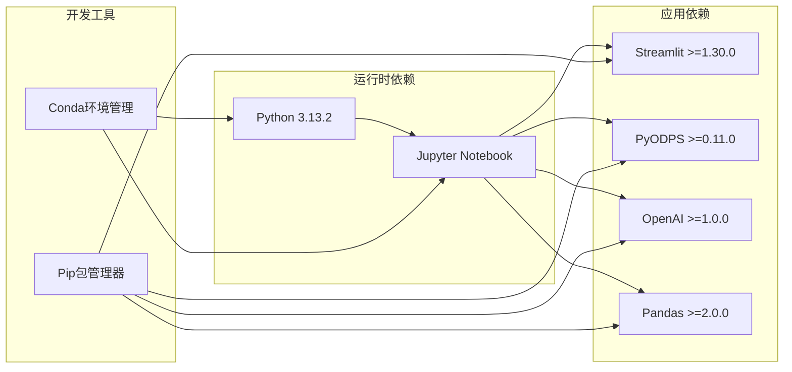

# 环境配置

<cite>
**本文档引用的文件**
- [Untitled-1.ipynb](file://ollma查询/Untitled-1.ipynb)
- [requirements.txt](file://ollma查询/requirements.txt)
</cite>

## 目录
1. [简介](#简介)
2. [项目结构](#项目结构)
3. [核心组件](#核心组件)
4. [架构概览](#架构概览)
5. [详细组件分析](#详细组件分析)
6. [依赖关系分析](#依赖关系分析)
7. [性能考虑](#性能考虑)
8. [故障排除指南](#故障排除指南)
9. [结论](#结论)
10. [附录](#附录)

## 简介

本文件是针对Jupyter Notebook开发环境的全面配置指南。该文档旨在帮助用户在不同操作系统环境下正确设置和配置Jupyter Notebook开发环境，特别关注Python 3.13.2内核的配置要求和设置步骤。文档涵盖了从基础安装到高级配置的完整流程，包括环境验证、故障排除、性能优化和最佳实践。

## 项目结构

基于当前仓库的分析，项目包含以下关键文件：



**图表来源**
- [Untitled-1.ipynb:1-43](file://ollma查询/Untitled-1.ipynb#L1-L43)
- [requirements.txt:1-5](file://ollma查询/requirements.txt#L1-L5)

**章节来源**
- [Untitled-1.ipynb:1-43](file://ollma查询/Untitled-1.ipynb#L1-L43)
- [requirements.txt:1-5](file://ollma查询/requirements.txt#L1-L5)

## 核心组件

### Jupyter Notebook元数据配置

根据Notebook文件分析，核心配置包括：

#### 内核规格配置
- **显示名称**: Python 3
- **语言**: python  
- **名称**: python3

#### 语言信息配置
- **代码镜像模式**: ipython (版本 3)
- **文件扩展名**: .py
- **MIME类型**: text/x-python
- **语言名称**: python
- **nbconvert导出器**: python
- **Pygments词法分析器**: ipython3
- **版本**: 3.13.2

**章节来源**
- [Untitled-1.ipynb:21-38](file://ollma查询/Untitled-1.ipynb#L21-L38)

### Python依赖包管理

项目使用requirements.txt文件管理依赖包：

| 包名称 | 版本要求 | 功能用途 |
|--------|----------|----------|
| streamlit | >=1.30.0 | Web应用框架 |
| pyodps | >=0.11.0 | 阿里云ODPS客户端 |
| openai | >=1.0.0 | OpenAI API客户端 |
| pandas | >=2.0.0 | 数据处理库 |

**章节来源**
- [requirements.txt:1-5](file://ollma查询/requirements.txt#L1-L5)

## 架构概览

Jupyter Notebook环境的系统架构如下：



**图表来源**
- [Untitled-1.ipynb:21-38](file://ollma查询/Untitled-1.ipynb#L21-L38)
- [requirements.txt:1-5](file://ollma查询/requirements.txt#L1-L5)

## 详细组件分析

### Python 3.13.2内核配置

#### 内核注册与发现
Jupyter通过内核规范文件发现和注册可用的Python内核。内核规范包含以下关键信息：
- 内核显示名称用于用户界面展示
- 语言标识符用于语法高亮
- 内核名称用于程序间通信

#### 语言信息映射
语言信息配置确保IDE和编辑器正确识别和处理Python代码：
- CodeMirror集成提供语法高亮
- MIME类型支持正确的文件处理
- Pygments词法分析器提供代码着色

**章节来源**
- [Untitled-1.ipynb:22-37](file://ollma查询/Untitled-1.ipynb#L22-L37)

### 依赖包管理系统

#### requirements.txt格式
该文件遵循标准的Python依赖声明格式：
- 每行一个包声明
- 版本约束使用比较操作符
- 注释以#开头（可选）

#### 包功能分析
每个依赖包的功能和用途：
- **streamlit**: 提供Web应用开发能力
- **pyodps**: 支持阿里云大数据平台访问
- **openai**: 提供AI模型集成接口
- **pandas**: 实现高效的数据结构和分析工具

**章节来源**
- [requirements.txt:1-5](file://ollma查询/requirements.txt#L1-L5)

## 依赖关系分析

### 组件依赖图



**图表来源**
- [requirements.txt:1-5](file://ollma查询/requirements.txt#L1-L5)
- [Untitled-1.ipynb:37](file://ollma查询/Untitled-1.ipynb#L37)

### 依赖冲突检测

基于当前配置，潜在的依赖冲突风险较低，因为所有包都声明了最低版本要求而非固定版本。这提供了足够的灵活性以避免版本冲突。

**章节来源**
- [requirements.txt:1-5](file://ollma查询/requirements.txt#L1-L5)

## 性能考虑

### 内存管理优化

#### Python进程内存优化
- 合理设置Jupyter内核内存限制
- 定期清理未使用的变量和对象
- 使用pandas的chunksize参数处理大文件

#### 缓存策略
- 利用Jupyter的缓存机制减少重复计算
- 对于OpenAI API调用实现适当的缓存
- 大数据集使用分块处理策略

### 并发处理优化

#### 多线程vs多进程
- I/O密集型任务优先考虑多线程
- CPU密集型任务考虑多进程
- Jupyter内核的并发限制

## 故障排除指南

### 常见配置问题及解决方案

#### 内核无法找到Python 3.13.2
**问题症状**: Jupyter显示"Kernel not found"错误
**解决步骤**:
1. 验证Python 3.13.2是否正确安装
2. 检查内核规范文件中的路径配置
3. 重新安装Python内核到Jupyter

#### 依赖包安装失败
**问题症状**: pip install命令执行失败
**解决步骤**:
1. 清理pip缓存：`pip cache purge`
2. 升级pip版本：`python -m pip install --upgrade pip`
3. 使用虚拟环境隔离依赖

#### Notebook文件加载错误
**问题症状**: 打开Notebook文件时报错
**解决步骤**:
1. 检查Notebook文件格式完整性
2. 验证元数据字段的有效性
3. 尝试在安全模式下启动Jupyter

### 环境验证检查清单

#### 基础验证
- [ ] Python版本确认：`python --version`
- [ ] Jupyter安装验证：`jupyter --version`
- [ ] 内核列表检查：`jupyter kernelspec list`
- [ ] 依赖包完整性：`pip list | grep -E "(streamlit|pyodps|openai|pandas)"`

#### 高级验证
- [ ] 内核规范验证：检查内核路径和配置
- [ ] 语言信息一致性：验证版本匹配
- [ ] 文件权限检查：确保读写权限正常
- [ ] 网络连接测试：验证API访问能力

**章节来源**
- [Untitled-1.ipynb:10-16](file://ollma查询/Untitled-1.ipynb#L10-L16)

## 结论

本配置指南提供了完整的Jupyter Notebook环境设置方案，重点关注Python 3.13.2内核的配置和管理。通过遵循本文档的步骤，用户可以在不同操作系统环境下成功建立稳定可靠的开发环境。

关键要点包括：
- 正确的内核配置和验证流程
- 有效的依赖包管理策略
- 全面的故障排除方法
- 性能优化的最佳实践

建议定期更新依赖包并监控环境状态，以确保开发工作的连续性和稳定性。

## 附录

### 不同操作系统安装指南

#### Windows系统
1. 下载Python 3.13.2安装包
2. 安装时勾选"Add to PATH"选项
3. 安装Jupyter：`pip install jupyter`
4. 验证安装：`jupyter --version`

#### macOS系统
1. 使用Homebrew安装Python：`brew install python@3.13`
2. 安装Jupyter：`pip install jupyter`
3. 可选：使用conda环境管理

#### Linux系统
1. 使用包管理器安装Python 3.13.2
2. 安装pip：`sudo apt install python3-pip`
3. 安装Jupyter：`pip install jupyter`
4. 添加到PATH环境变量

### 虚拟环境管理

#### 创建隔离环境
```bash
# 使用venv
python -m venv myproject_env

# 使用conda
conda create -n myproject_env python=3.13.2
```

#### 环境激活
```bash
# Windows
myproject_env\Scripts\activate

# macOS/Linux
source myproject_env/bin/activate
```

#### 环境导出
```bash
# 导出依赖
pip freeze > requirements.txt

# 导出conda环境
conda env export > environment.yml
```

### 最佳实践建议

#### 项目组织
- 将Notebook文件与数据文件分离
- 使用版本控制系统管理代码
- 保持依赖文件的更新和维护

#### 安全考虑
- 定期更新依赖包以修复安全漏洞
- 避免在Notebook中硬编码敏感信息
- 使用环境变量管理配置参数

#### 开发效率
- 利用Jupyter的自动补全功能
- 使用Markdown单元格记录文档
- 实现代码模块化和重用