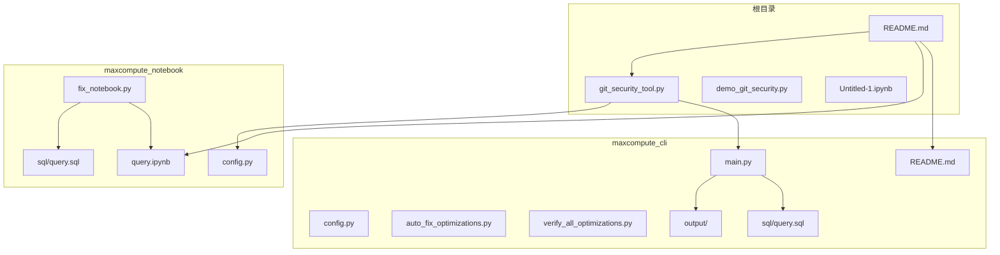
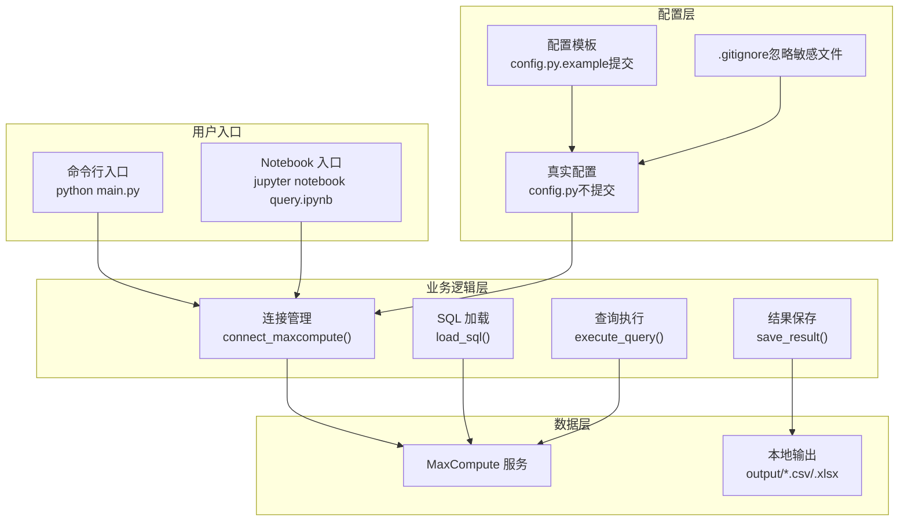
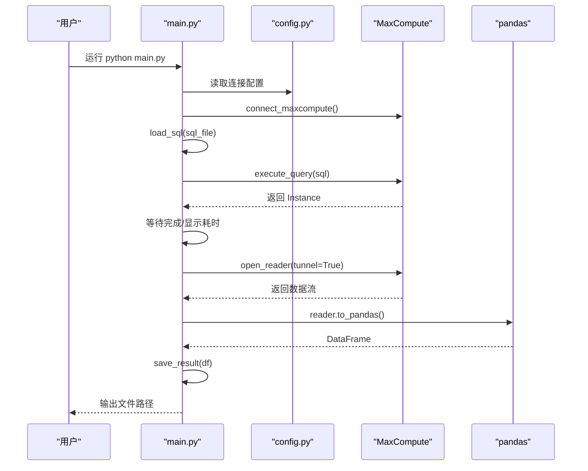
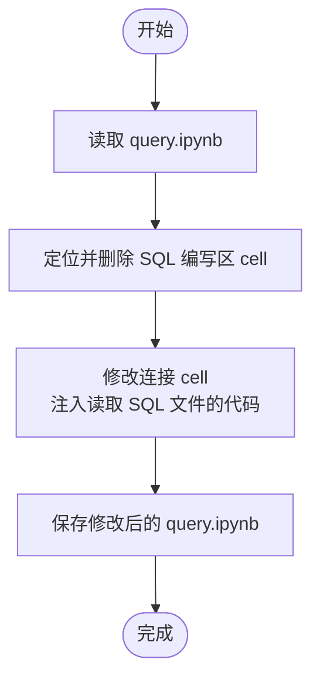
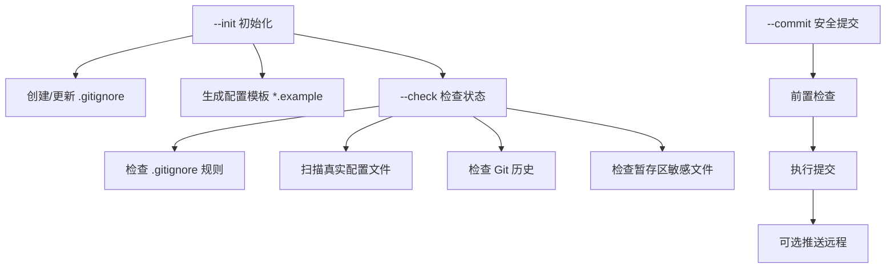
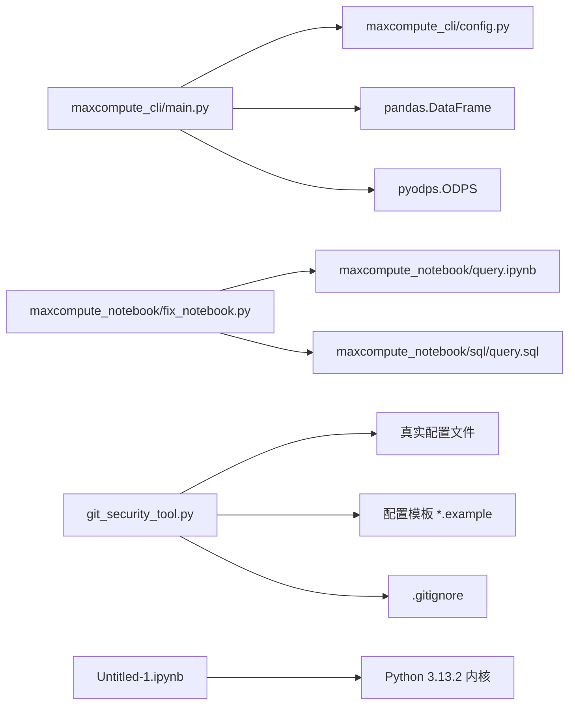

# 项目概述

<cite>
**本文引用的文件**
- [README.md](file://README.md)
- [maxcompute_cli/README.md](file://maxcompute_cli/README.md)
- [maxcompute_cli/main.py](file://maxcompute_cli/main.py)
- [maxcompute_cli/config.py](file://maxcompute_cli/config.py)
- [maxcompute_cli/auto_fix_optimizations.py](file://maxcompute_cli/auto_fix_optimizations.py)
- [maxcompute_cli/verify_all_optimizations.py](file://maxcompute_cli/verify_all_optimizations.py)
- [maxcompute_cli/query.sql](file://maxcompute_cli/query.sql)
- [maxcompute_notebook/config.py](file://maxcompute_notebook/config.py)
- [maxcompute_notebook/fix_notebook.py](file://maxcompute_notebook/fix_notebook.py)
- [maxcompute_notebook/sql/query.sql](file://maxcompute_notebook/sql/query.sql)
- [git_security_tool.py](file://git_security_tool.py)
- [demo_git_security.py](file://demo_git_security.py)
- [Untitled-1.ipynb](file://Untitled-1.ipynb)
</cite>

## 目录
1. [引言](#引言)
2. [项目结构](#项目结构)
3. [核心组件](#核心组件)
4. [架构总览](#架构总览)
5. [详细组件分析](#详细组件分析)
6. [依赖关系分析](#依赖关系分析)
7. [性能考虑](#性能考虑)
8. [故障排除指南](#故障排除指南)
9. [结论](#结论)
10. [附录](#附录)

## 引言
本项目是一个基于 Jupyter Notebook 的极简数据分析与 MaxCompute 查询工具，提供两种使用形态：命令行版本（CLI）与 Notebook 版本，均支持从外部 SQL 文件读取查询语句并执行，结果自动保存到本地文件。项目同时内置完整的 Git 敏感信息保护机制，确保 AccessKey 等密钥不被意外提交到版本库。

- 项目目标：为数据分析与机器学习开发提供便捷、可复用、安全的查询工具链
- 核心功能：SQL 查询执行、结果导出、性能监控、敏感信息保护
- 适用场景：数据分析、数据挖掘、报表生成、模型训练数据准备、Python 生态集成

## 项目结构
项目采用 zip 包模块化架构，主要由以下部分组成：
- CLI 版本：独立的 Python 脚本集合，包含配置、主程序、SQL 文件、输出目录与验证/修复工具
- Notebook 版本：Jupyter Notebook 环境，配合配置与 SQL 文件，支持交互式查询与结果可视化
- Git 敏感信息保护：自动化工具链，用于初始化、检查、模板生成与安全提交

**图表来源**
- [README.md:155-188](file://README.md#L155-L188)
- [maxcompute_cli/README.md:122-134](file://maxcompute_cli/README.md#L122-L134)
- [maxcompute_notebook/fix_notebook.py:1-56](file://maxcompute_notebook/fix_notebook.py#L1-L56)

**章节来源**
- [README.md:155-188](file://README.md#L155-L188)
- [maxcompute_cli/README.md:122-134](file://maxcompute_cli/README.md#L122-L134)

## 核心组件
本项目包含两大核心组件：

1) Jupyter Notebook 环境
- 作用：提供交互式数据分析与可视化能力，适合探索性分析与快速原型开发
- 关键文件：query.ipynb、config.py、sql/query.sql
- 特点：支持从外部 SQL 文件读取查询语句，便于与 CLI 版本共享 SQL 逻辑

2) 业务逻辑模块（CLI）
- 作用：封装 MaxCompute 连接、SQL 加载、查询执行、结果保存与性能监控
- 关键文件：main.py、config.py、verify_all_optimizations.py、auto_fix_optimizations.py
- 特点：启用 Instance Tunnel 加速、显示 LogView 链接、输出详细耗时统计

技术栈概览
- Python 3.13.2 内核（Notebook 环境）
- pyodps（MaxCompute Python SDK）
- pandas（数据处理）
- Jupyter Notebook（交互式开发）
- Git（版本控制与敏感信息保护）

**章节来源**
- [maxcompute_cli/main.py:22-96](file://maxcompute_cli/main.py#L22-L96)
- [maxcompute_cli/config.py:5-22](file://maxcompute_cli/config.py#L5-L22)
- [maxcompute_notebook/config.py:5-22](file://maxcompute_notebook/config.py#L5-L22)
- [maxcompute_notebook/fix_notebook.py:22-49](file://maxcompute_notebook/fix_notebook.py#L22-L49)
- [README.md:192-199](file://README.md#L192-L199)

## 架构总览
系统采用“配置分离 + 自动化工具 + 多形态入口”的架构设计，确保安全性与易用性并重。

**图表来源**
- [maxcompute_cli/main.py:22-96](file://maxcompute_cli/main.py#L22-L96)
- [maxcompute_cli/config.py:5-22](file://maxcompute_cli/config.py#L5-L22)
- [git_security_tool.py:53-136](file://git_security_tool.py#L53-L136)

## 详细组件分析

### 组件一：CLI 业务逻辑模块
CLI 版本提供从 SQL 文件读取查询语句并执行的完整流程，具备性能优化与安全特性。

**图表来源**
- [maxcompute_cli/main.py:22-96](file://maxcompute_cli/main.py#L22-L96)
- [maxcompute_cli/config.py:5-22](file://maxcompute_cli/config.py#L5-L22)

关键实现要点
- 连接管理：统一读取 AccessKey、Project、Endpoint 等配置
- SQL 加载：支持注释过滤与多行 SQL 处理
- 查询执行：启用 Instance Tunnel 加速、显示 LogView 链接、统计执行耗时
- 结果保存：自动创建输出目录、按时间戳命名文件、支持 CSV/Excel

**章节来源**
- [maxcompute_cli/main.py:22-96](file://maxcompute_cli/main.py#L22-L96)
- [maxcompute_cli/config.py:5-22](file://maxcompute_cli/config.py#L5-L22)

### 组件二：Notebook 环境与模块化改造
Notebook 版本通过脚本将 SQL 编写区移除并注入外部 SQL 文件读取逻辑，实现与 CLI 版本的配置共享。

**图表来源**
- [maxcompute_notebook/fix_notebook.py:3-56](file://maxcompute_notebook/fix_notebook.py#L3-L56)

关键实现要点
- 删除 Markdown + Code 两处 SQL 编写区 cell
- 在连接 cell 中追加读取外部 SQL 文件的代码
- 保持原有执行逻辑不变，仅替换数据源

**章节来源**
- [maxcompute_notebook/fix_notebook.py:3-56](file://maxcompute_notebook/fix_notebook.py#L3-L56)

### 组件三：Git 敏感信息保护工具链
项目提供完整的自动化工具链，确保敏感配置不被提交到版本库。

**图表来源**
- [git_security_tool.py:260-291](file://git_security_tool.py#L260-L291)
- [git_security_tool.py:184-258](file://git_security_tool.py#L184-L258)
- [git_security_tool.py:292-331](file://git_security_tool.py#L292-L331)

关键实现要点
- 自动创建 .gitignore 并添加敏感文件忽略规则
- 从真实配置生成模板文件，避免密钥泄露
- 提供安全提交流程，支持一键检查与提交

**章节来源**
- [git_security_tool.py:260-291](file://git_security_tool.py#L260-L291)
- [git_security_tool.py:184-258](file://git_security_tool.py#L184-L258)
- [git_security_tool.py:292-331](file://git_security_tool.py#L292-L331)

## 依赖关系分析
组件间的耦合与协作关系如下：

**图表来源**
- [maxcompute_cli/main.py:14-19](file://maxcompute_cli/main.py#L14-L19)
- [maxcompute_notebook/fix_notebook.py:4-53](file://maxcompute_notebook/fix_notebook.py#L4-L53)
- [git_security_tool.py:27-36](file://git_security_tool.py#L27-L36)
- [Untitled-1.ipynb:13-21](file://Untitled-1.ipynb#L13-L21)

**章节来源**
- [maxcompute_cli/main.py:14-19](file://maxcompute_cli/main.py#L14-L19)
- [maxcompute_notebook/fix_notebook.py:4-53](file://maxcompute_notebook/fix_notebook.py#L4-L53)
- [git_security_tool.py:27-36](file://git_security_tool.py#L27-L36)
- [Untitled-1.ipynb:13-21](file://Untitled-1.ipynb#L13-L21)

## 性能考虑
- Instance Tunnel 加速：通过实例隧道加速数据传输，使查询速度与 DataWorks 保持一致
- 耗时监控：分别统计 SQL 执行耗时、数据下载耗时与总耗时，便于性能分析
- 日志链接：提供 LogView 链接，可在控制台查看详细执行计划与性能指标
- 配置优化：合理设置 SQL 超时时间与最大返回行数，平衡性能与稳定性

最佳实践
- SQL 优化：添加分区过滤条件、减少扫描数据量、避免 SELECT *
- 定期清理：定期清理 output 目录中的历史结果文件
- 日志记录：可扩展日志模块，记录查询执行过程与异常信息

**章节来源**
- [README.md:202-246](file://README.md#L202-L246)
- [maxcompute_cli/README.md:110-119](file://maxcompute_cli/README.md#L110-L119)
- [maxcompute_cli/README.md:202-238](file://maxcompute_cli/README.md#L202-L238)

## 故障排除指南
常见问题与解决方案

- GitHub 阻止推送
  - 症状：远程拒绝包含密钥的推送
  - 解决：使用配置模板与 .gitignore，必要时重写 Git 历史或使用 BFG 清理工具

- 连接失败
  - 症状：AccessKeyIdNotFound 或 Invalid credentials
  - 解决：检查 config.py 中 AccessKey 配置、确认账号权限

- 查询超时
  - 症状：Timeout 或长时间无响应
  - 解决：增加 SQL_TIMEOUT、优化 SQL、减少返回数据量

- 速度仍然较慢
  - 症状：即使启用 Tunnel 仍较慢
  - 解决：查看 LogView 执行计划、优化 SQL、调整 MAX_RESULT_ROWS

- Tunnel 连接失败
  - 症状：无法连接到 Tunnel Endpoint
  - 解决：检查网络连通性、添加防火墙白名单

**章节来源**
- [README.md:311-357](file://README.md#L311-L357)
- [maxcompute_cli/README.md:160-200](file://maxcompute_cli/README.md#L160-L200)

## 结论
本项目通过 CLI 与 Notebook 两种形态，结合 Git 敏感信息保护机制，构建了一个安全、高效、易用的 MaxCompute 查询工具链。其模块化设计便于扩展与维护，适合数据分析、机器学习开发与 Python 生态系统的多种应用场景。建议团队在日常开发中遵循安全提交流程，定期运行优化验证脚本，持续改进查询性能与代码质量。

## 附录

### 实际使用示例
- CLI 版本
  - 配置 AccessKey：复制模板并填写真实密钥
  - 编写 SQL：在 sql/query.sql 中编写查询语句
  - 执行查询：运行 python main.py
  - 查看结果：在 output 目录中查看导出文件

- Notebook 版本
  - 配置 AccessKey：复制模板并填写真实密钥
  - 执行查询：在 Jupyter 中运行 query.ipynb
  - 结果可视化：利用 pandas 与可视化库进行分析

- 安全提交
  - 初始化：python git_security_tool.py --init
  - 检查：python git_security_tool.py --check
  - 提交：python git_security_tool.py --commit "feat: 描述"

**章节来源**
- [README.md:17-61](file://README.md#L17-L61)
- [maxcompute_cli/README.md:15-61](file://maxcompute_cli/README.md#L15-L61)
- [git_security_tool.py:333-356](file://git_security_tool.py#L333-L356)